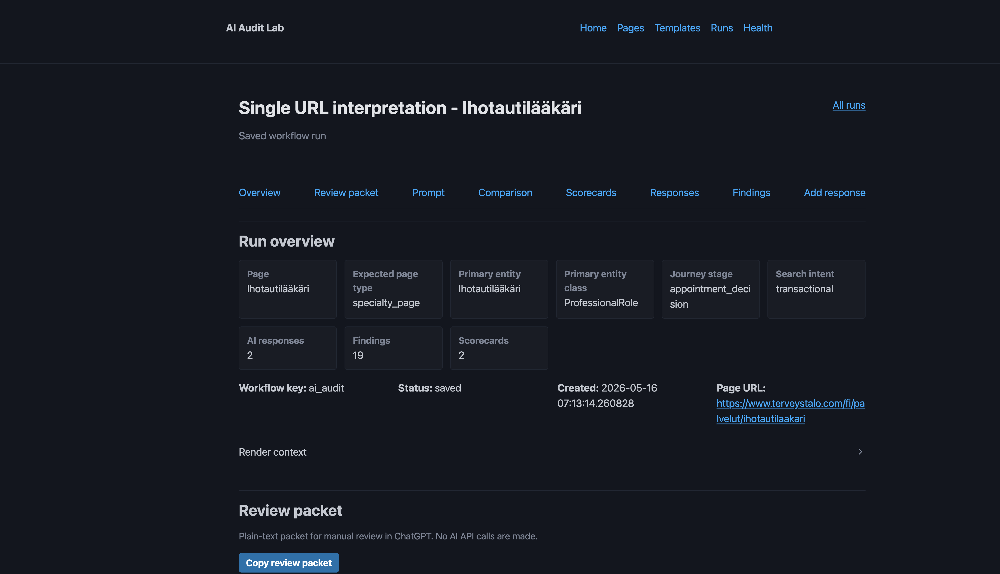
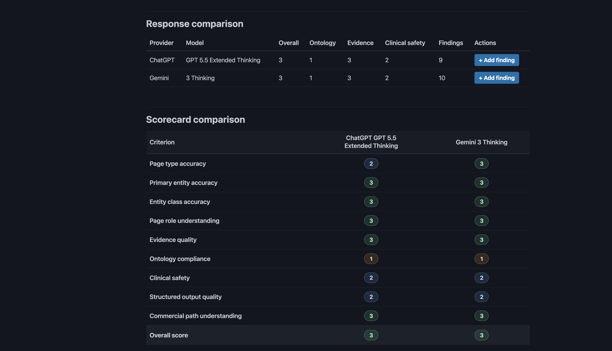
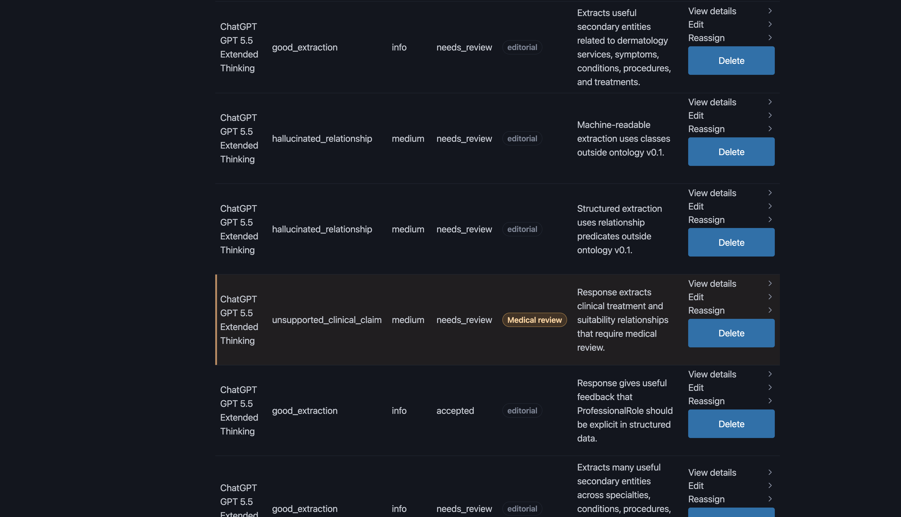

# Case study: AIAuditLab

## Tilanne

Markkinointi- tai sisältötiimi haluaa ymmärtää, miten AI-avusteiset hakupalvelut ja kielimallit tulkitsevat yrityksen verkkosisältöjä.

Ongelma ei ole vain se, että AI:ta pitäisi kokeilla. Ongelma on se, että kokeiluista pitäisi saada toistettava ja tarkistettava työnkulku.

## Ratkaisu

AIAuditLab kokoaa sivut, prompt-pohjat, AI-vastaukset, manuaaliset löydökset ja arvioinnit samaan paikalliseen työtilaan.

Työnkulku auttaa muuttamaan yksittäiset AI-kokeilut hallituksi tarkistusprosessiksi.

## Työnkulku

1. Valitaan tarkistettava sivu.
2. Täydennetään sivun taustatiedot.
3. Renderöidään prompt-pohja.
4. Kopioidaan prompt AI-työkaluun.
5. Liitetään vastaus takaisin työtilaan.
6. Kirjataan löydökset.
7. Tehdään manuaalinen arvio.
8. Tallennetaan tarkistushistoria.

## Miksi tämä on arvokasta

AIAuditLab tekee AI-aiheen käsittelystä käytännöllistä. Se ei jää ideatasolle, vaan näyttää miten tiimi voisi arvioida sisältöjä, vastauksia ja löydöksiä järjestelmällisesti.

## Portfolioarvo

Tämä case näyttää erityisesti:

- AI-käyttötapausten rajaamista
- tarkistusprosessien suunnittelua
- markkinoinnin ja sisällön työnkulkujen ymmärrystä
- paikallisen työkalun suunnittelua
- ihmisen tekemän arvioinnin pitämistä mukana prosessissa

## Kuvakaappaukset

Lisää myöhemmin:

- `assets/screenshots/ai-audit-lab-pages.png`
- `assets/screenshots/ai-audit-lab-prompt-render.png`
- `assets/screenshots/ai-audit-lab-workflow-run.png`

## Screenshots

### Run overview

### Scorecard comparison

### Findings

