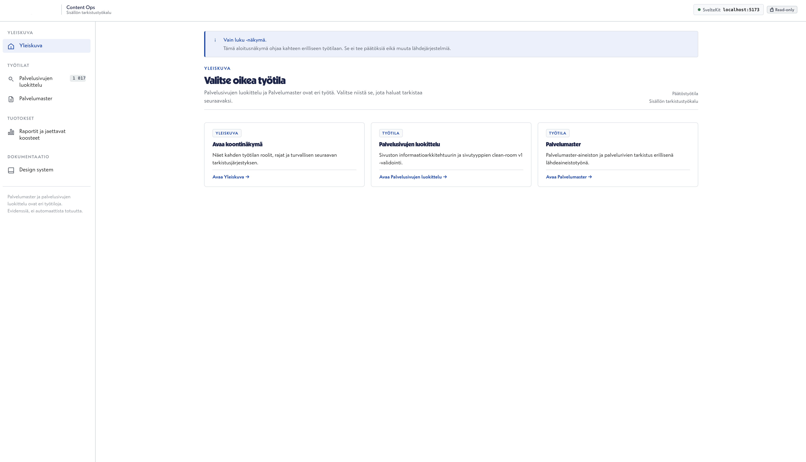
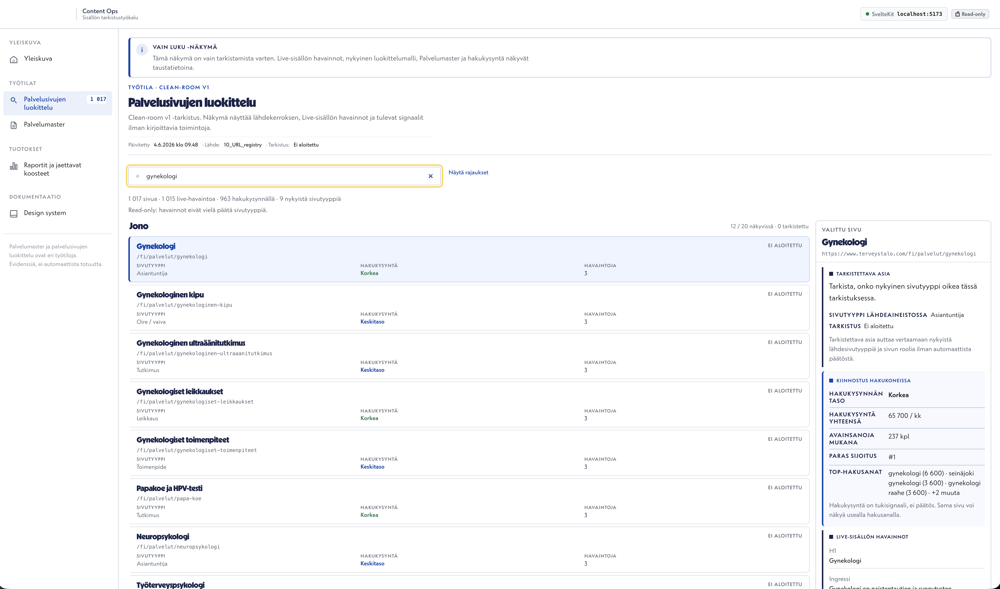

# Case study: Content Ops Platform

Content Ops Platform on paikallinen tarkistustyötila, joka auttaa jäsentämään palvelusivujen, sivutyyppien, hakukysynnän ja lähdeaineistojen tarkistustyötä.

## Tilanne

Laajassa sivustossa sisältöön, sivurakenteeseen, hakukysyntään ja palvelutietoon liittyvät havainnot ovat helposti hajallaan eri lähteissä.

Tiimin pitää pystyä näkemään:

- mitkä sivut vaativat tarkistusta
- miksi ne vaativat tarkistusta
- mitä hakukysyntä kertoo
- mitä live-sisällöstä havaitaan
- mikä on seuraava käsiteltävä asia

## Mitä tässä rakennettiin

Content Ops Platform kokoaa sivut, tarkistustarpeet ja päätöstyötä tukevat havainnot samaan käyttöliittymään.

Työkalu ei tee päätöksiä automaattisesti. Se auttaa ihmistä näkemään olennaisen tilanteen ja etenemään järjestelmällisesti.

## Työnkulku

1. Avataan sisältö- tai sivustotyön yleisnäkymä.
2. Valitaan tarkistettava työtila.
3. Rajataan sivujoukkoa esimerkiksi hakusanalla.
4. Valitaan yksittäinen sivu.
5. Tarkistetaan sivun taustatiedot, hakukysyntä ja live-sisällön havainnot.
6. Päätetään seuraava tarkistus tai kehitystoimi.

## Screenshots

### Overview

Yleisnäkymä kokoaa eri tarkistustyötilat yhteen. Tavoite on auttaa käyttäjää valitsemaan, mitä kokonaisuutta hän haluaa käsitellä seuraavaksi.

### Service classification workbench

Palvelusivujen luokittelunäkymä näyttää työjonon, valitun sivun ja päätöstyötä tukevat havainnot samassa näkymässä. Hakukysyntä, nykyinen sivutyyppi ja live-sisällön havainnot tukevat tarkistusta ilman automaattista päätöstä.

## Miksi tämä on arvokasta

Content Ops Platform auttaa muuttamaan laajan sivumassan käytännön tarkistustyöksi. Se vähentää hajanaista selvittelyä ja tekee seuraavan käsiteltävän asian näkyväksi.

## Rajaus

Demo on paikallinen tarkistus- ja päätöstyötila. Se ei tee automaattisia CMS-muutoksia eikä julkaise muutoksia lähdejärjestelmiin.

## Linkit

- [Portfolio landing page](../../index.html)
- [Content Ops scenario](../../scenarios/content-ops-platform-scenario.md)
- [Content Ops demo description](../../demos/02-content-ops-platform/README.md)
